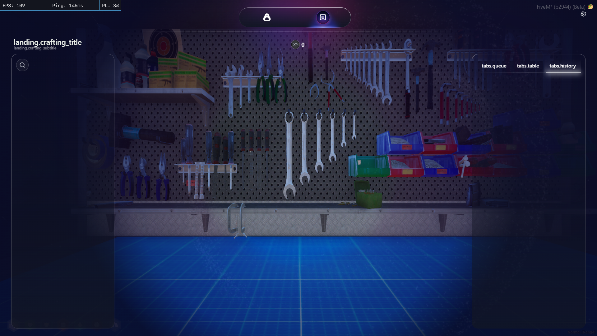
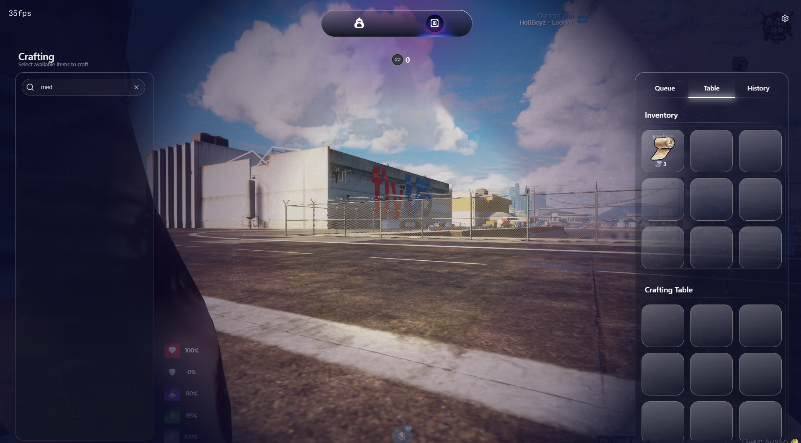

# Troubleshooting

<details>

<summary><strong>No locales in the UI</strong></summary>

I see the UI but no locales available.



**Solution** : Your admin menu is different from the ones specified in the bridge. If you don't use qb-admin/esx-admin/qbox-admin, change the code that checks for admin perms in the bridge/Client/client.lua. If you are unable to, please contact our support for help.

</details>

<details>

<summary><strong>I can't edit the admin perms code or my admin menu doesn't have the proper exports</strong></summary>

I get that I need to edit the admin perms but i can't seem to get the code or my admin menu doesn't have the exports to check if a player is admin or not.&#x20;

**Solution :** Use this code instead of the ones in the bridge to set constant admins using their fivem licence

```
local adminLicenses = { --Add at the top of Bridge/Client/client.lau
    "license:7fe53b6e6dfde554d237bcb3eb2cb60748203bd0" --Add more admin licences
}
--Add the below code in checkAdminPermission(source) code
 if Config.Core == 'qb-core' then --or use in esx codeblock if you use esx
            local playerData = getPlayerdata()
            local identifier = playerData.license
            print('Identifier found is: ',identifier)
            if identifier then
                for _, adminLicense in ipairs(adminLicenses) do
                    if identifier == adminLicense then
                        hasPermission = true
                        break
                    end
                end
                if not hasPermission then
                    notify(Translations.ingame.notifications.not_authorized, "error")
                end
            else
                notify(Translations.ingame.notifications.not_authorized, "error")
            end
            isReady = true
            return hasPermission
    end --Don;t use this if you're replacing before the else line
```

</details>

<details>

<summary><strong>No Items in crafting menu</strong></summary>

I see the UI but there's no items in crafting menu


**Solution :** Make sure all repair materials are available in the items list of your inventory. If you added a new table, make sure you entered all whitelisted items for each table.&#x20;

</details>

<details>

<summary><strong>Wrong camera transition after adding new table</strong></summary>

I added a new table but am getting worng camera transition after saving from admin panel



**Solution :** Make sure you restart the script after adding new table through the admin panel or without it and saving any new settings!&#x20;

</details>

<details>

<summary><strong>Assets not downloading during connecting to server</strong></summary>

Some users are complaining of assets not download, redownloading, being stuck during connection to server


**Solution :**&#x20;

&#x20;**1.**   Ask users to clear their fivem cache, server cache and reconnect

2. If that doesn't fix it, remove glb files for weapons(located in  html/build) that you are not using currently to reduce size of build and ask users to try joining again

</details>

<details>

<summary>I can't see some of the images in the UI</summary>


Make sure you have correct image named in the craftingRecipes for the item in question, and copy the inventory image of the item in html/build. Example, copper's image is copper.png

</details>
